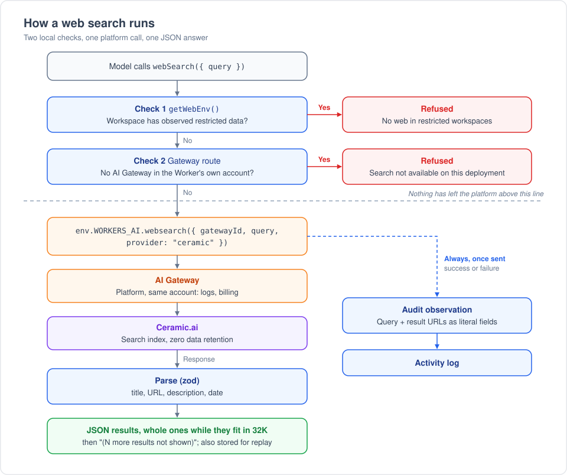
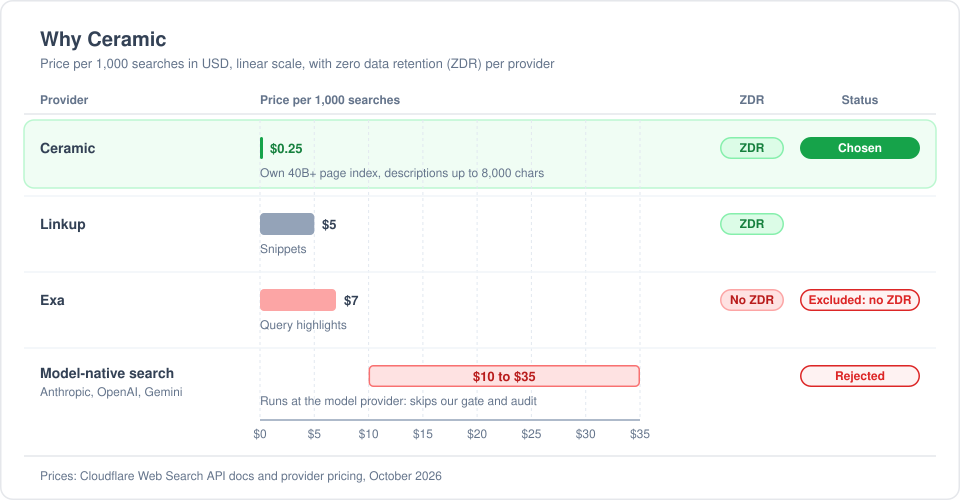
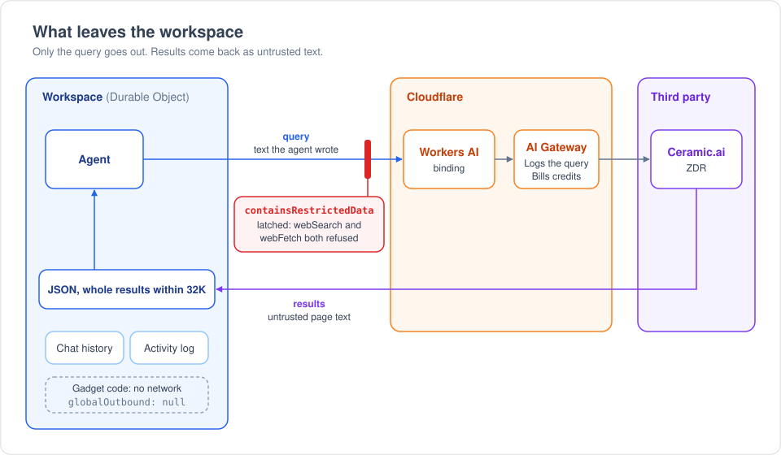
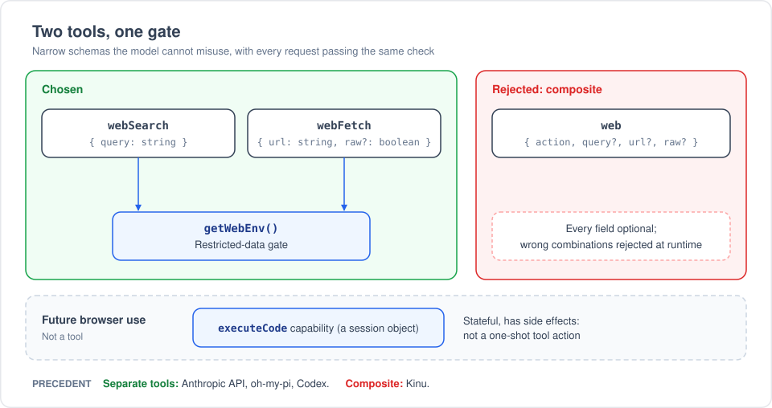
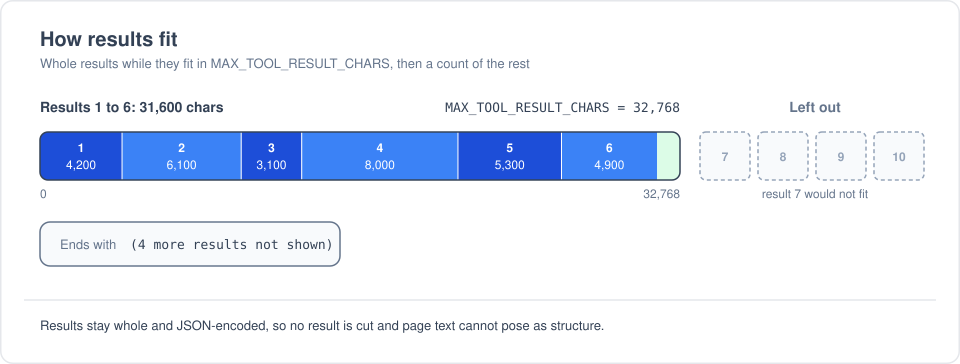

# Web search

The agent's `webSearch` tool searches the public web through Cloudflare's
[Web Search API](https://developers.cloudflare.com/web-search/). It sits next to `webFetch`:
search finds pages, fetch reads them. Both tools pass through one security gate, and both record
every request in the workspace's Activity log.

## The tool

| | |
|---|---|
| Schema | `webSearch({ query })`, `query` 1 to 1,024 characters (the API's limits). The model sets no result count and picks no provider. |
| Call | `env.WORKERS_AI.websearch({ gatewayId, query, provider: "ceramic" })`, through the platform's AI Gateway. The API's default of 10 results is also its maximum. |
| Output | The results as JSON: title, URL, description, last-modified date. Stored on the tool call, so replay never searches again. |
| Code | `packages/workshop-backend/src/web-search.ts`; the tool in `agent.ts`; the gate, `getWebEnv()`, in `overseer.ts`. |

## Why Cloudflare's Web Search API

- It runs on the `WORKERS_AI` binding and the AI Gateway that every deployment already has. We add
  no binding, config, release-manifest entry, secret or vendor contract.
- Logs, billing and provider keys stay in one place: the AI Gateway.
- The standalone `web_search` Worker binding (`env.WEBSEARCH.search`) is not an option. Cloudflare
  removed it before launch
  ([workers-sdk#15453](https://github.com/cloudflare/workers-sdk/pull/15453)). Its types are still in
  the generated `worker-configuration.d.ts` files.
- We use the binding only. The REST endpoint could serve deployments whose gateway is in another
  account, but its token needs Workers AI Read, which our gateway tokens don't carry.

## Why Ceramic

- **Zero data retention.** A query can carry workspace text, so the provider must not keep it. Exa
  offers no zero data retention, so we exclude it.
- **Cost.** $0.25 per 1,000 searches: a twentieth of Linkup and a twenty-eighth of Exa.
- **Content.** Ceramic runs its own index of 40B+ pages and returns descriptions of up to 8,000
  characters, so a result often answers the question without a fetch.
- **Pinned in code.** We set `provider: "ceramic"` instead of trusting the API's default, which
  Cloudflare could change to a provider that keeps data.
- **No fallback chain.** Each fallback would be one more way out of the platform.
- **Linkup** is the other provider with zero data retention. Switching to it is a one-constant change
  if Ceramic's results disappoint.

What we rejected:

- **Model-native search** (Anthropic, OpenAI, Gemini). It runs at the model provider, so it skips our
  restricted-data gate and our audit. It differs per provider, costs $10 to $35 per 1,000, and some
  versions open pages themselves.
- **Direct vendor APIs** (Brave, Tavily, Parallel and others). Each needs a new secret and sends
  traffic outside the gateway. Brave also restricts storing results, and we store tool output for
  replay.

## Security

`webSearch` follows the same model as `webFetch`:

| Rule | Reason |
|---|---|
| `getWebEnv()` refuses once the workspace has observed restricted data. It is the first call. | The query is text the agent wrote, sent to a third party: the same leak as a URL. |
| Refuse when no gateway is in the Worker's own account. | The binding reaches only those gateways. |
| Build the observation with gatekeeper-kit's `buildDescription`: the query and result URLs go in literal fields. | The audit log must show exactly what was sent. Agent and page text is never read as Markdown, and the kit escapes a value that holds invisible characters. |
| Record one observation as soon as the query is sent, whether the search succeeds or fails. | A failed search still sent the query out. |
| Return results as JSON. | Page text is untrusted and can't pose as structure or as another result. |
| Offer the tool to spawned agents. | Same as `webFetch`; a search only reads. |
| Never log the query. | Our logging rules forbid prompts and similar agent text. |

Known limits:

- **Prompt injection.** Results are page text. The tool description tells the model not to follow
  instructions in them. Nothing structural marks a chat as having read untrusted text; `webFetch` has
  the same limit.
- **Content-Signal.** `webFetch` refuses pages that send `Content-Signal: ai-input=no`. Search
  descriptions come from the provider's index, so we can't check that signal for them.
- **Zero data retention depends on billing.** It holds when searches bill AI Gateway credits. If an
  operator stores their own Ceramic key on the gateway as `default`, their own agreement with
  Ceramic applies instead.
- **Gateway logs.** AI Gateway logs keep the query (payload logging is on by default), next to the
  prompts the same gateway already logs.

## Two tools, not one `web` tool

- **Exact schemas.** `webSearch` requires `query`; `webFetch` requires `url`. A composite tool makes
  every field optional and rejects wrong combinations at runtime.
- **Precedent.** Anthropic's API, oh-my-pi and Codex keep search separate from fetch. Kinu uses one
  composite `web` tool with flat optional fields.
- **Shared policy needs one gate, not one tool.** Both tools call `getWebEnv()`.
- **Browser use comes later, as an `executeCode` capability**: a session object the agent drives from
  code. A browser has state and side effects (clicks, form posts), so it doesn't fit a one-shot tool
  call.

## How results fit

The tool keeps as many whole results as fit in `MAX_TOOL_RESULT_CHARS` (32,768) and ends with a
note of how many it left out, as `grep` does with matches. No field is cut. Ten results of
Ceramic's longest descriptions (8,000 characters) would not fit, so the rule is needed.

## Deployment

- **Requirement:** AI Gateway mode with the binding transport: `CF_AI_GATEWAY` set, `WORKERS_AI`
  bound, and `CF_AI_GATEWAY_USE_BINDING` not `false`. Without it, the tool tells the agent search is
  not available on this deployment.
- **Billing:** each search bills the platform gateway's AI Gateway credits, or a Ceramic key stored
  on the gateway. Without either, searches fail and the agent sees the gateway's status and message.
- **Funded users** (`ENABLE_CLOUDFLARE_LIMITS`): their searches also go through the platform gateway.
  The platform pays, and their queries land in the platform gateway's logs. The binding can't reach
  a gateway in their account.
- **Local dev:** `pnpm run dev-server -- --use-workers-ai-binding` with the `CF_AI_GATEWAY*` vars.
  Needs workerd 1.20260924.1 or later.

## Not in this change

- A REST route for deployments whose gateway is in another account (its token needs Workers AI
  Read).
- A route through a funded user's own gateway (needs a search endpoint their token can call).
- Browser use as an `executeCode` capability.
- Fetching search-result URLs in restricted workspaces (see the TODO in `getWebEnv()`).
